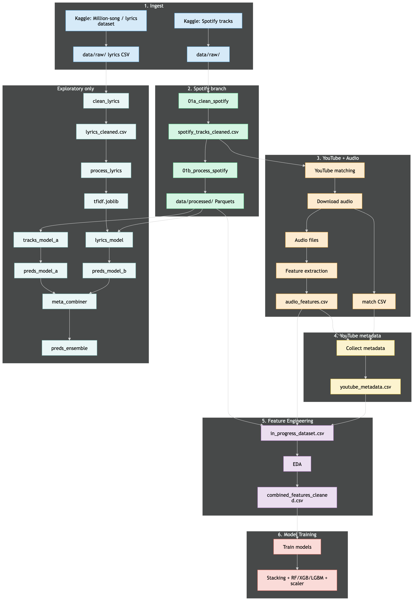

# viral-content-predictor

**50.038 Computational Data Science — Spring 2026**

End-to-end pipeline to relate **Spotify** track data, **lyrics**, **YouTube** matches, **librosa** audio features, and **engagement** signals for viral / popularity modeling, ensembling (RF, XGBoost, LightGBM, stacking), and exploratory notebooks.

---

## Prerequisites

- **Python 3.10+** (3.12+ or 3.14 works; for notebooks and ML stack, a stable 3.12 venv is often smoother than the newest patch release)
- **Git**
- **Make** (optional but recommended for setup and data downloads)
- A [Hugging Face](https://huggingface.co/) account and token for datasets and pretrained artifacts (see below)

> [!NOTE]
> You can always check by running these commands:
>
> - `python3 --version`
> - `python3 -m pip --version` (or `pip3 --version`)
> - `make --version` (usually installed on macOS/Linux)
> - `git --version`
> - After `make setup` and `make setup-huggingface`: `.venv/bin/hf version` or `.venv/bin/hf auth whoami`
>
> Or run this from the repository root and it will run the checks for you:
>
> ```bash
> make prereq
> ```

---

## Quick start

### 1. Create a virtual environment

From the repository root:

```bash
python3 -m venv .venv
source .venv/bin/activate   # Windows: .venv\Scripts\activate
```

### 2. Install dependencies

```bash
pip install --upgrade pip
pip install -r requirements.txt
```

Or use the Makefile helper (creates `.venv` with `python3 -m venv` if missing, then installs dependencies):

```bash
make setup
```

To **remove only** the virtual environment (keeps `data/`), use `make rm-venv` and then `make setup` again when you want a clean env.

> **`requirements.txt`** in this repo is a **fully pinned** dependency set (suitable for `pip install -r` in a fresh venv). If you maintain a shorter “loose” list elsewhere, keep it under another filename so installs stay reproducible.

### 3. Hugging Face CLI login

Install the Hub CLI via the same dependency set, then authenticate:

```bash
make setup-huggingface
```

This installs `huggingface_hub`, runs `hf auth login` interactively, and stores your token for `hf download` / uploads. If you already have the Hub installed but need to sign in again (expired token, new machine, or you skipped the Makefile step), run:

```bash
.venv/bin/hf auth login
```

Use `hf auth login` instead if the `hf` executable is already on your `PATH`.

Verify with:

```bash
.venv/bin/hf auth whoami
```

Create a token under [Hugging Face → Settings → Access Tokens](https://huggingface.co/settings/tokens) if you do not have one.

### 4. Download datasets and artifacts

All download scripts pull from the **`vancenceho`** Hugging Face org into `data/` or `notebooks/models/`. Run **`make setup`** first so `.venv` contains `hf`.

**Suggested order** (matches the pipeline: raw → cleaned → processed → models):

```bash
make download-spotify                          # data/raw/spotify_tracks.csv
make download-lyrics                           # data/raw/spotify_millsongdata.csv
make download-youtube-audio-features           # data/raw/audio_features.csv
make download-spotify-tracks-clean             # data/cleaned/spotify_tracks_cleaned.csv
make download-spotify-lyrics-clean             # data/cleaned/lyrics_cleaned.csv
make download-youtube-features-clean         # data/processed/youtube_features_cleaned.csv
make download-vcp-combined-features          # data/processed/combined_features_cleaned.csv
make download-vcp-combined-ensemble-stacking # notebooks/models/*.joblib (stacking + base learners)
```

To run the same sequence in one go:

```bash
make download-all
```

Re-run a single target after `HF_SKIP_EXISTING=0` if you need to force a refresh. See `make help` for short descriptions of each target.

> **Note:** Large files stay **out of Git** (see `.gitignore`). Local-only CSVs and models are optional if you regenerate everything from notebooks instead.

### 5. Streamlit demo (optional)

The project includes a small **Streamlit** UI under `app/` that loads the **stacking ensemble** (RF, XGBoost, LightGBM, meta-learner, scaler) from Hugging Face Hub (`vancenceho/vcp-combined-ensemble-stacking`) and serves predictions plus static EDA figures from `app/assets/`.

- Complete **`make setup`** and **`make setup-huggingface`** first (Hub token required for the first model download).
- From the repository root:

```bash
make app
```

This target runs `make setup` to ensure the venv and dependencies exist, then starts Streamlit (default URL **http://localhost:8501**).

To run the same entrypoint manually with the venv active:

```bash
source .venv/bin/activate
streamlit run app/app.py
```

---

## Pipeline architecture

High-level flow (ingest → Spotify branch → YouTube/audio → metadata → feature join → training):



- **Ingest:** Spotify tracks and Million Song–style lyrics land under `data/raw/`.
- **Spotify branch:** `01a` cleans → `01b` engineers parquets under `data/processed/`.
- **YouTube + audio:** matching, MP3 download, `02b` librosa features → `audio_features.csv`.
- **YouTube metadata:** `02c` builds `youtube_metadata.csv` (and related tables).
- **Feature engineering:** joins yield `in_progress_dataset` / EDA outputs → **`combined_features_cleaned.csv`**.
- **Training:** `03_combined_model_training` fits **stacking + RF / XGB / LGBM + scaler** (and saves figures under `notebooks/images/`).

An **exploratory** track (lyrics TF‑IDF, Model A/B preds, meta-combiner) lives under `notebooks/exploratory/` and feeds optional ensemble predictions (`preds_model_a`, `preds_model_b`, `preds_ensemble`).

---

## Running notebooks (recommended order)

Run Jupyter from the repo with the venv activated. Paths in notebooks assume execution with working directory **`notebooks/`** unless a cell sets `Path` relative to the project root—check the first path cells in each notebook.

| Order | Notebook                                     | Purpose                                                           |
| ----: | -------------------------------------------- | ----------------------------------------------------------------- |
|     1 | `01a_clean_spotify.ipynb`                    | Clean raw Spotify CSV → `data/cleaned/spotify_tracks_cleaned.csv` |
|     2 | `01b_process_spotify.ipynb`                  | Parquets + baselines under `data/processed/`                      |
|     3 | `01c_spotify_eda.ipynb`                      | EDA on Spotify / processed tables                                 |
|     4 | `01d_spotify_model_baseline.ipynb`           | Model A (track features)                                          |
|     5 | `02a_youtube_parallel_match_download.ipynb`  | YouTube match + audio download                                    |
|     6 | `02b_youtube_audio_feature_extraction.ipynb` | Librosa features → `data/raw/audio_features.csv`                  |
|     7 | `02c_youtube_collect_metadata.ipynb`         | YouTube metadata merge                                            |
|     8 | `02d_youtube_eda.ipynb`                      | EDA on YouTube-side features                                      |
|     9 | `02e_youtube_model_baseline.ipynb`           | YouTube / engagement baseline                                     |
|    10 | `03_combined_model_training.ipynb`           | Combined features → stacking ensemble + plots                     |

**Exploratory / optional** (can run after cleaned data exists):

- `mid-term-spotify-eda.ipynb` (mid-term EDA snapshot)
- `exploratory/explore_lyrics_clean.ipynb`, `explore_lyrics_preprocess.ipynb`
- `exploratory/explore_spotify_tracks_model_A.ipynb`, `explore_spotify_lyrics_model_B.ipynb`
- `exploratory/explore_youtube_engagement_ensemble.ipynb`, `explore_combined_enesmble_voting.ipynb`, `explore_meta_ensemble_combiner.ipynb`

---

## Further reading

- **`docs/project-report.pdf`** — full project write-up (methods, experiments, results).
- **`docs/project-description.pdf`**, **`docs/project-guideline.pdf`** — coursework briefs and expectations.

---

## Project structure

```text
viral-content-predictor/
├── README.md
├── LICENSE
├── Makefile                 # setup, venv/rm-venv, app (Streamlit), download-* targets
├── requirements.txt         # pinned transitive deps (full lock-style list)
├── app/
│   ├── app.py              # Streamlit app (Hub models + JSON feature input)
│   └── assets/             # EDA figures for the UI
├── docs/
│   ├── pipeline-architecture.png
│   ├── project-report.pdf
│   ├── project-description.pdf
│   └── project-guideline.pdf
├── data/
│   ├── raw/                 # spotify_tracks, lyrics, audio_features, … (gitignored blobs)
│   ├── cleaned/             # *_cleaned.csv (gitignored; HF or notebooks)
│   └── processed/           # parquets, combined_features_cleaned.csv, preds, …
├── notebooks/
│   ├── 01a_clean_spotify.ipynb … 03_combined_model_training.ipynb
│   ├── exploratory/         # optional ensemble / lyrics / EDA notebooks
│   ├── images/              # training plots (often gitignored *.png)
│   └── models/              # joblib artifacts (gitignored; HF download target)
└── scripts/
    ├── setup-huggingface.sh
    └── download-*.sh        # Hugging Face CLI wrappers per dataset/model repo
```

---

## Makefile cheat sheet

| Command                  | Description                                                   |
| ------------------------ | ------------------------------------------------------------- |
| `make help`              | List all targets                                              |
| `make prereq`            | Print versions for Python, pip, make, git, and `hf` (if venv exists) |
| `make venv`              | Create `.venv` with `python3 -m venv` if it does not exist   |
| `make rm-venv`           | Delete `.venv` only (does **not** remove `data/`)            |
| `make setup`             | Create venv + `pip install -r requirements.txt`               |
| `make setup-huggingface` | Install `huggingface_hub` + `hf auth login`                 |
| `make app`               | Run `make setup`, then the Streamlit app (`app/app.py` → `http://localhost:8501`) |
| `make download-all`      | Run all eight `download-*` targets in pipeline order          |
| `make download-<name>`   | See [§ Download datasets](#4-download-datasets-and-artifacts) |
| `make cleanup`           | Remove venv **and** scratch data files under `data/` (destructive) |

---

## Acknowledgements

- **Course:** 50.038 Computational Data Science, **Spring 2026**, Information Systems Technology and Design (**ISTD**), **Singapore University of Technology and Design ([SUTD](https://www.sutd.edu.sg/))**.
- **Data & tools:** [Spotify](https://developer.spotify.com/) Web API / track features conventions, [Kaggle](https://www.kaggle.com/)-style public dumps used in early ingestion, [YouTube](https://www.youtube.com/) metadata policies, [librosa](https://librosa.org/), [scikit-learn](https://scikit-learn.org/), [XGBoost](https://xgboost.readthedocs.io/), [LightGBM](https://lightgbm.readthedocs.io/), [Hugging Face Hub](https://huggingface.co/docs/huggingface_hub) for reproducible artifacts.

---

## License

See `LICENSE` in the repository root.
